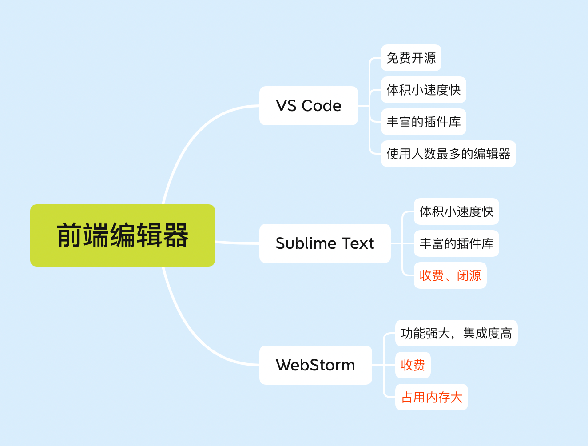
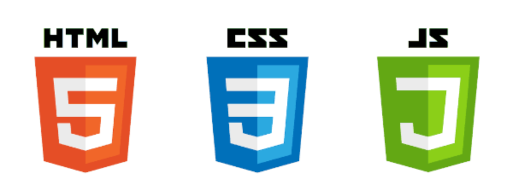
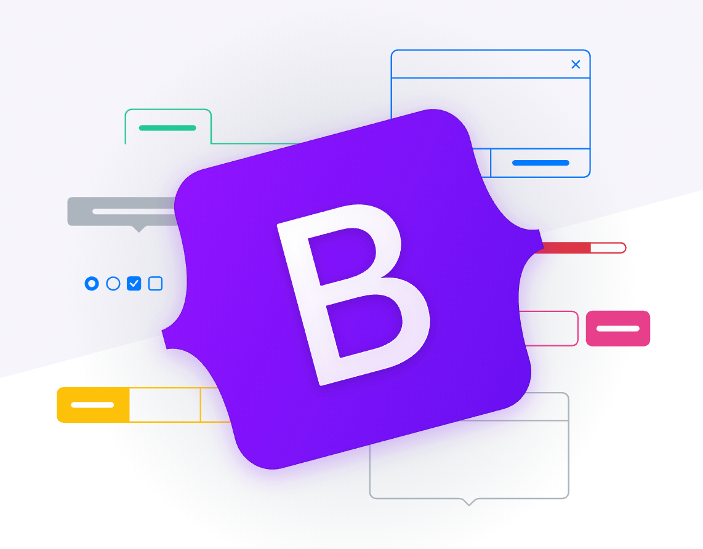
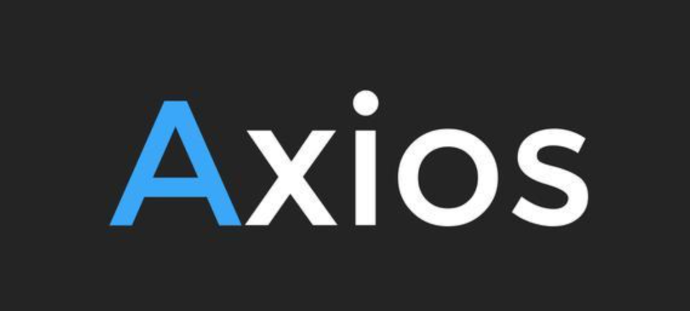
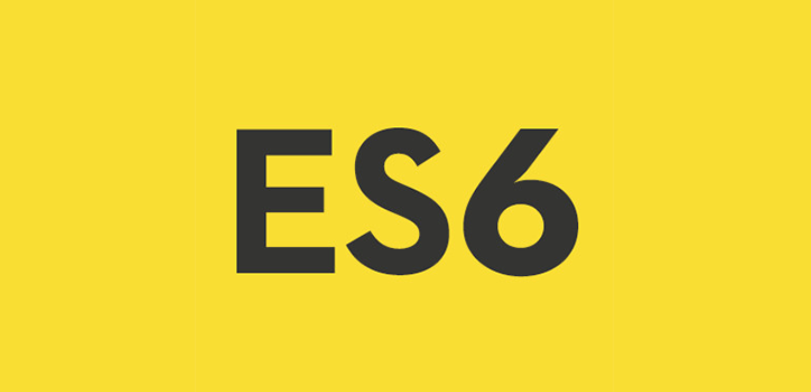
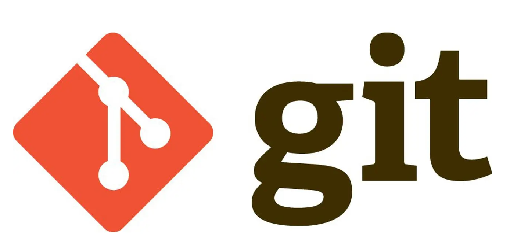
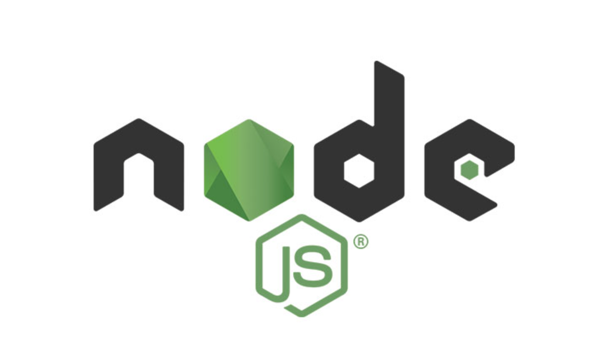
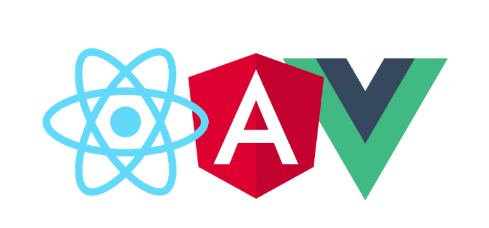
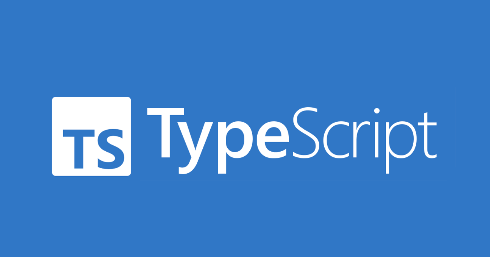

## 前言

有很多小伙伴想要入门前端，但前端技术如今如此繁杂，那我们到底应该如何学习呢？希望这篇路线文章可以对你有所帮助。

## 前端编辑器:

前端编辑器种类繁多，这里给大家介绍三款开发人员最常用的编辑器。

### Visual Studio Code

简称 `VS Code`，是Web开发人员中最受欢迎的文本编辑器。`VS Code`免费开源，且它的可定制性是让程序员最喜爱的功能，它支持数千个插件和主题，开发者可以安装这些插件和主题以进一步增强其功能，我推荐同学们使用它。

VS Code官网下载地址: [https://code.visualstudio.com/](https://code.visualstudio.com/)

### Sublime Text

`Sublime`同样具备体积小速度快，不占用大量内存的优势，也可以通过安装插件来扩展它。不过`Sublime`是收费的，虽然可以免费下载和使用，但会不断的收到一条弹出消息，提醒您购买许可证。因为其简单易上手，新同学可以考虑使用。

Sublime Text下载地址: [http://www.sublimetext.cn/](http://www.sublimetext.cn/)

### Webstorm

`Webstorm`集成了很多功能，功能比较强大，使用比较体验比较好。但是集成的东西太多，对电脑的要求也高。配置比较低的话，打开速度会比较卡慢。不想自己动手配置编辑器的懒人同学对自己电脑性能自信的话可以考虑使用它。

Webstorm官网下载地址: [https://www.jetbrains.com/webstorm/](https://www.jetbrains.com/webstorm/)

## 前端三大件

好了，相信你已经开始下定决心要成为前端大神了，那咱们第一步就是把前端的核心装备拿下，它们分别是`Html`,`CSS`和`JavaScript`。

### HTML(5)

`html`是用来编写网页代码结构的，它有一系列的标签用于显示不同的页面元素，比如用`<a/>` 显示一个超链接，``显示一张图片。

### CSS(3)

但只是单纯用`html`只能写页面的内容，不能进行排版和美化样式，如果让网页变得漂亮，需要 `css`。`css`是用来美化`html`编写的页面的，通过一些语法选择特定的`html`标签，然后用一些属性来给它们添加样式，比如文字颜色，背景，位置，边距，定位等等，还可以添加动画效果让页面显示的栩栩如生。

### JavaScript

在学完`html`,`css`之后，咱们就可以写漂亮的页面了，那么接下来就是需要学习`JavaScript`，让网页能和人进行互动，比如点击按钮弹出个对话框，处理用户输入的表单信息，添加一些复杂的动画等等。它可以直接操作`html`元素，给网页开发提供了无限可能。

> 刚刚入门的同学每学习完一部分就敲一遍对应的代码，加深记忆。

## UI 框架

`UI`框架提供了页面的基本`UI`样式和布局系统，比如按钮、对话框、轮播图，省了自己去开发，在本阶段你可以学习一下`Boostrap`, 用最快最少的时间学习一套`UI`框架并感受`响应式布局`。

>响应式布局:
>现在手机和平板差不多要比电脑都流行了，所以一个网站要适应不同尺寸的屏幕，有这种特性的网站就叫做响应式网站。实现这种响应式网站的`CSS`布局方式便是响应式布局。
>Bootstrap官网: [https://www.bootcss.com/](https://www.bootcss.com/)

## Ajax

`AJAX`通过在后台与服务器进行少量数据交换，使网页实现异步更新。

在日常的网页开发过程中，`ajax`无处不在，比如我们在购物时候看到的商品列表都是实时更新的数据，这时我们就不能在前端把数据写死，而是通过`ajax`与后端交互获取数据再渲染到页面上。再比如在注册登录的时候填写了手机号和密码，这些信息最终是需要保存到数据库当中的，此时也需要通过`ajax`将表单数据提交和传递。

在此阶段，我们还需要学习当前前端的流行库`axios`，它帮助研发人员对`ajax`进行了封装，让开发更高效。

> axios中文文档: [http://axios-js.com/zh-cn/docs/index.html](http://axios-js.com/zh-cn/docs/index.html)

## ES6

ES6是JavaScript语言的下一代标准，已经在2015年6月正式发布了。所以又称ES2015。它的目标，是使得JavaScript语言可以用来编写复杂的大型应用程序，成为企业级开发语言。

简单理解`ES6`就是`JavaScript`的高级语法，在开发过程中十分常用，也是我们学习的重中之重。有精力的同学推荐看一下《ES6 标准入门》这本书，可以让你对ES6的知识体系有更好的了解。

## Git

`Git`是一款免费、开源的分布式版本控制系统，用于敏捷高效地处理任何或小或大的项目。简单说就是`Git`工具作用是来帮助管理你的代码，让你的代码在管理上更清晰。

在此阶段我建议大家都创建一个`GitHub`账号，`GitHub`是软件源代码托管服务平台，大家可以将自己写过的代码放到`GitHub`上，以后一定会是一笔宝贵的财富。

> Git官网：[https://git-scm.com/](https://git-scm.com/)
> GitHub官网：[https://github.com/](https://github.com/)

## Node

`Node`是一个服务器端的JS运行环境，可以让程序员通过JS做后台服务器编程开发。我们在电脑上装上`Node`环境就可以写后端啦，之后就可以出门自称全栈大佬啦。

除了基本的搭建服务器、增删改查知识点外，还要学会使用`npm`装包（Node环境安装完成后就可以使用npm指令装包啦）、文件的导入导出等，为以后三大框架的学习做准备。

前端常用的node框架推荐是`express`、`koa`，有余力的同学可以学习一下。

> Node官网地址: [https://nodejs.org/](https://nodejs.org/)

## 前端三大框架

### React

`React`, Facebook出品，正式版推出是在2013年，`React`引入了一种组件驱动、函数式和声明式的编程风格，以单页Web应用创建交互式用户界面。通过`虚拟DOM`，React 提供了非常快的渲染速度，只需渲染发生变化的部分，而不用渲染整个页面。`React`的另一个基本特点是使用更简单的`JSX`语法，而不是`JavaScript`。

尽管学习`React`比其他框架要复杂一些，但是`React`拥有一个庞大的开发者社区、丰富的学习资源，并被世界各地广泛采用。

不管是`Stack Overflow`开发者调查，还是`State of JS`调查，在前端`JavaScript`框架榜单中，React 始终名列前茅，一直是最受欢迎的前端`JavaScript`框架。

> React官网：[https://zh-hans.reactjs.org/](https://zh-hans.reactjs.org/)

### Vue

`Vue.js`是一种轻量级、开源的`JavaScript`框架，用最小的努力来构建创造性的用户界面和高性能单页 Web 应用。

`Evan Yu`在2014年首次发布了`Vue`，他是一名谷歌开发者，从`Angular`中获得了灵感，以 `Vue.js`的形式提供了一个简单、轻量级、高效的替代方案。`Vue`从`React`和`Angular`获得了许多特性，但是这些特性已经得到了大幅改进，从而提供了一个更好、更易用、更安全的框架。`Vue`提供了`Angular`所见的双向数据绑定，以及`React`所见的`虚拟 DOM`。

同样，`Vue`也非常灵活，使其能够像`Angular`那样作为一个完整的端到端框架，也可以像 `React`那样作为一个有状态的视图层。所以`Vue`的主要优势在于它的渐进式性质，它更简单，更容易上手，并且不会做太多限制来满足开发者的需求。`Vue`在过去几年中迅速流行起来，取代了`Angular`和`React`复杂的统治地位，成为最好的`JavaScript`框架。有些全球最大的公司，比如 Adobe、苹果、宝马等都采用了 Vue。

> Vue官网: [https://cn.vuejs.org/index.html](https://cn.vuejs.org/index.html)

### Angular

`Angular`是由谷歌工程师`Misko Hevery`和`Adam Abrons`在 2010 年创建的，名为 `AngularJS`（或 Angular 1）。`AngularJS`曾广为人知，也曾最受欢迎，但`React`的出现暴露了它严重的缺陷，后来被人们遗忘了。因此，在2016年，`AngularJS`完全从零开始重写，并更名为 Angular2（或简称`Angular`）。

`AngularJS`（Angular 1）的灵感来自`React`。它们有了很大的变化，最重要的变化就是从`MVW（Model-View-Whatever）`架构转变为类似React的面向组件的架构。如今，`Angular`已经成为构建企业应用最安全的`JavaScript`框架典范；超过100万的网站都在使用`Angular`，包括谷歌、福布斯、IBM和微软。

> Angular官网: [https://angular.cn/docs](https://angular.cn/docs)

### 我们如何选？

剧统计2021前端框架榜单中： React > Vue > Angular, 那我们究竟如何选择？

面对大佬：都学。

面对咸鱼：React/Vue两框架在国内使用较多，建议先学其中之一，后续把另一个补充。

## Webpack

前端构建工具有很多种，目前最广泛应用的依旧还是`Webpack`。

`Webpack`是一个前端资源加载和打包工具。所谓的模块就是在平时的前端开发中，用到一些静态资源，如JavaScript、CSS、图片等文件，`webpack`就将这些静态资源文件称之为模块。 `webpack`支持`AMD`和`CommonJS`，以及其他的一些模块系统，并且兼容多种JS书写规范，可以处理模块间的依赖关系，所以具有更强大的JS模块化的功能，它能对静态资源进行统一的管理以及打包发布。

作为一款 Grunt和Gulp的替代产品，Webpack受到大多数开发者的喜爱，因为它能够编译打包CSS，做CSS预处理，对JS的方言进行编译，打包图片，代码压缩等等。

> webpack官网: [https://webpack.js.org/](https://webpack.js.org/)

## TypeScript

TypeScript 是微软编写的一款带类型的 JavaScript 语言，它的代码可以编译成普通的 JavaScript，但是编写的时候支持强类型，并且支持完全面向对象的形式。它的好处在于带有了类型之后，代码更容易维护，适合大型项目的开发。

目前前端的主流框架都是采用TypeScript编写，比如`React`和`Vue3`，故前端对`TypeScript`的要求也随之增高。

## 结语

一起努力，顶峰相见！！！