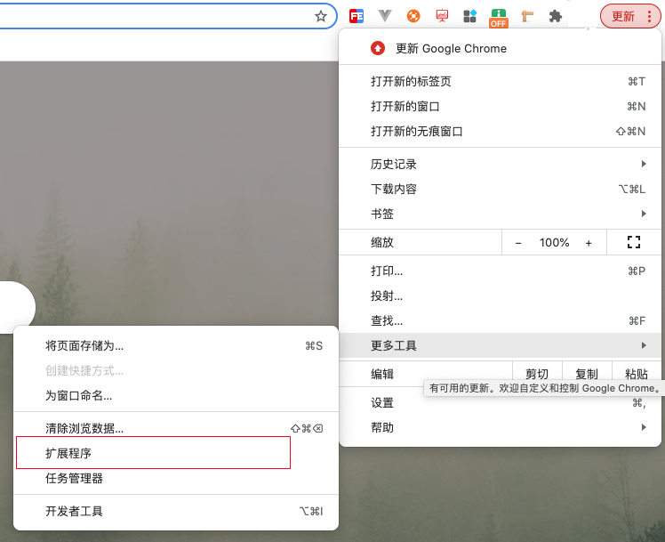
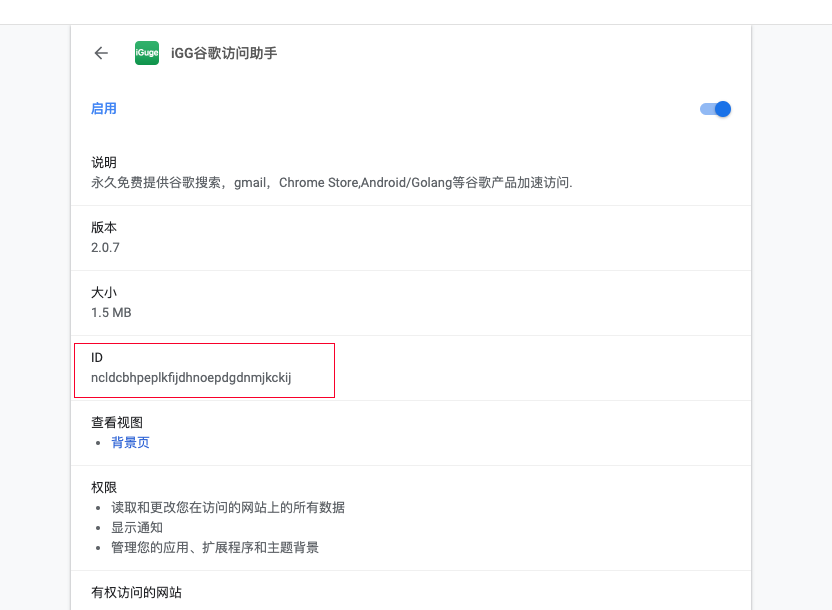
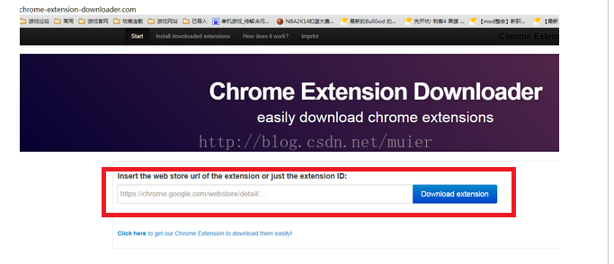
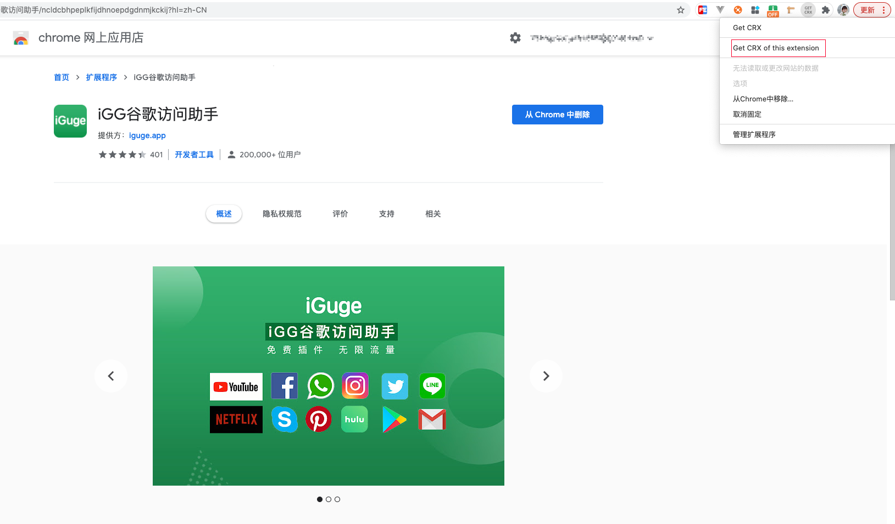

## 前言

上篇文件为大家介绍了常用的Chrome插件，那怎样把我们浏览器中使用的插件保存到本地了，今天就让我们一起来看一下。

本文将介绍谷歌浏览器扩展程序下载教程，下载谷歌扩展文件到电脑上的步骤，帮助玩家享受多功能化的谷歌浏览器。

## 两种下载方式

### 一、通过ID下载

① 查找插件ID

首先进入谷歌浏览器的设置界面，找到想下载插件的对应ID。

② 下载扩展

将ID粘贴到网址http://chrome-extension-downloader.com/，点击download，即可将浏览器中的插件下载到本地啦。

### 二、通过GET CRX工具下载

① 安装`Get CRX`插件

打开chrome网上商店，搜索`Get CRX`，进行扩展的下载操作。

> `Get CRX`插件安装地址: https://chrome.google.com/webstore/detail/get-crx/dijpllakibenlejkbajahncialkbdkjc?hl=zh-CN

② 下载.crx文件

安装完成后，在扩展安装页点击右上角的插件图标，并选择 `Get CRX of this extension` 就可以下载啦。

> 注意要在`扩展安装页面`插件才可以生效哦（如下图所示）。

