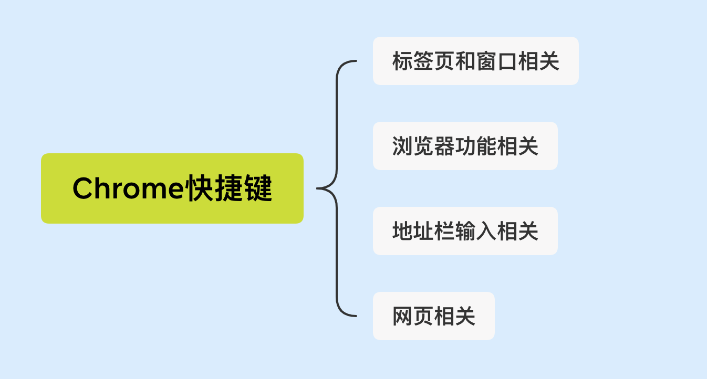

## 前言

好好学，日常装逼用得到。

### 一、标签页和窗口相关

|  快捷键   | 效果  |
|  ----  | ----  |
| ⌘-N  | 打开新窗口 |
| ⌘-T  | 打开新标签页 |
| ⌘-Shift-N  | 打开新的无痕窗口 |
| ⌘-O  | 选择文件在浏览器中打开 |
| 按住 ⌘ 并点击链接  | 在新标签页中打开链接 |
| 按住 ⌘-Shift 并点击链接 | 在新标签页中打开链接并切换到刚打开的标签页 |
| 按住 Shift 键并点击链接  | 在新窗口中打开链接 |
| ⌘-Shift-T | 打开上次关闭的标签页 |
| ⌘-Option-右箭头 | 切换到下一个标签页 |
| ⌘-Option-左箭头 | 切换到上一个标签页 |
| ⌘-W | 关闭当前标签页 |
| ⌘-Shift-W | 关闭当前窗口 |
| ⌘-M | 最小化窗口 |
| ⌘-H | 隐藏 Chrome 浏览器 |
| ⌘-Q | 关闭 Chrome 浏览器 |

### 二、浏览器功能相关

| 快捷键 | 效果 |
| --- | --- |
| ⌘-Shift-B | 打开和关闭书签栏 |
| ⌘-Option-B | 打开书签管理器 |
| ⌘-, | 打开"偏好设置"页 |
| ⌘-Y | 打开"历史记录"页 |
| ⌘-Shift-J | 打开"下载内容"页 |
| ⌘-Shift-Delete | 打开“清除浏览数据”对话框 |

### 三、地址栏输入相关

| 快捷键 | 效果 |
| --- | --- |
| Option-左箭头 | 将光标移到地址栏中的前一个关键字词 |
| Option-右箭头 | 将光标移到地址栏中的下一个关键字词 |
| Shift-Option-左箭头 | 在地址栏中突出显示上一关键字词 |
| Shift-Option-右箭头 | 在地址栏中突出显示下一关键字词 |

### 四、网页相关

| 快捷键 | 效果 |
| --- | --- |
| ⌘-P | 打印当前网页 |
| ⌘-S | 保存当前页面 |
| ⌘-Shift-I | 通过电子邮件发送当前网页 |
| ⌘-R | 重新载入当前网页 |
| ⌘-F | 在当前页中查找 |
| ⌘-E | 使用所选内容查找 |
| ⌘-Option-I | 打开"开发人员工具" |
| ⌘-Option-J | 打开"JavaScript 控制台" |
| ⌘-Option-U | 打开当前网页的源代码 |
| ⌘-D | 将当前网页保存为书签 |
| ⌘-Shift-F | 切换全屏模式 |
| ⌘-+ | 放大网页上的所有内容 |
| ⌘-- | 缩小网页上的所有内容 |
| ⌘-0 | 将网页上的所有内容恢复到正常大小 |
| ⌘-Shift-H | 在当前标签页中打开主页 |
| 空格键 | 向下滚动网页 |

[Chrome键盘快捷键-官方链接文档](https://support.google.com/chrome/answer/157179?hl=zh-Hans&hlrm=en-GB&topic=25799&ctx=topic&visit_id=636861692230899464-415404307&rd=1)