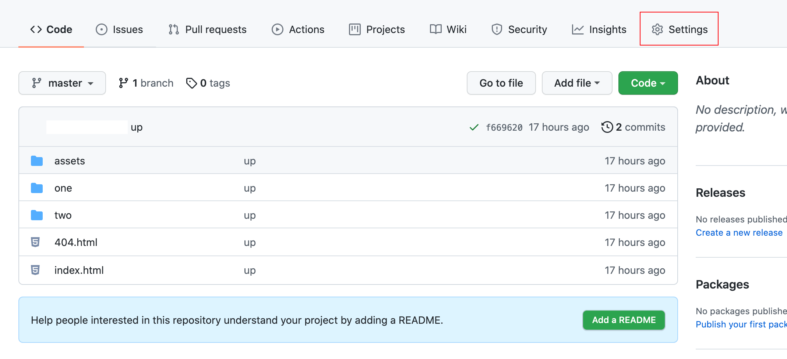
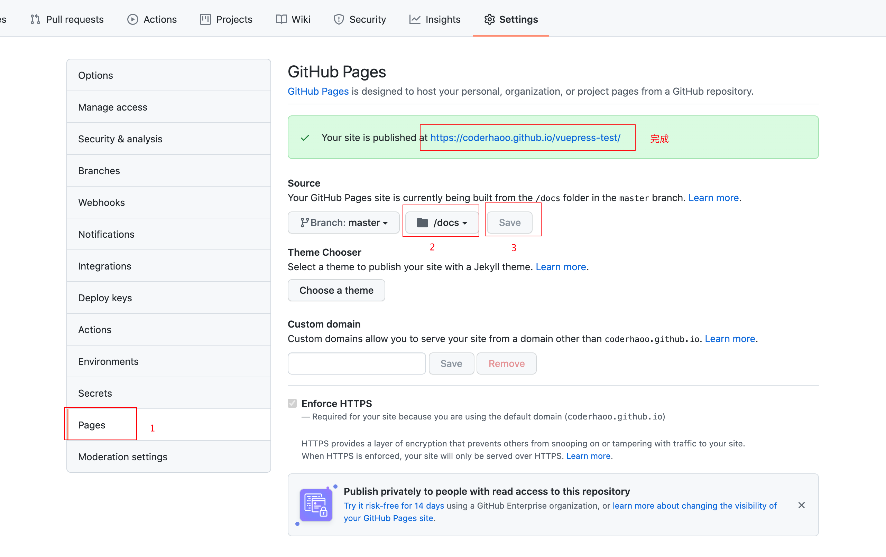
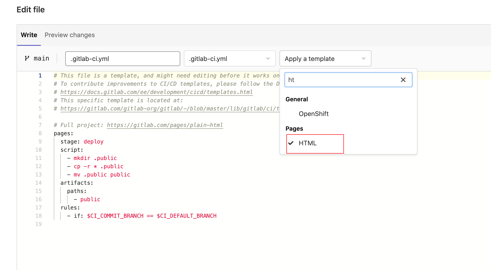
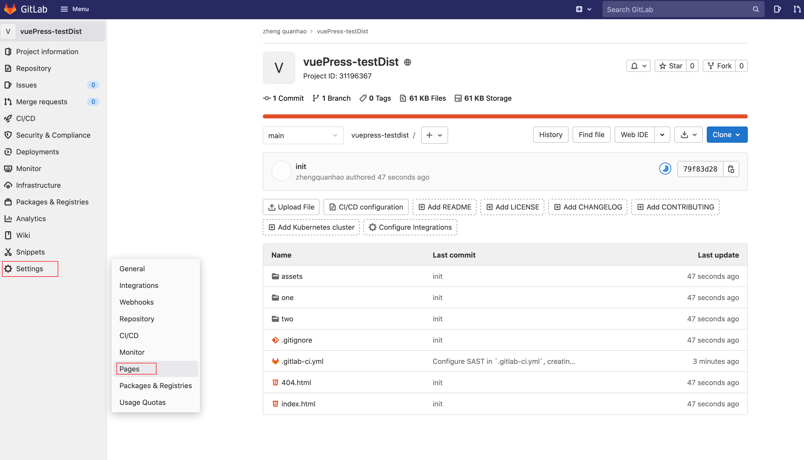
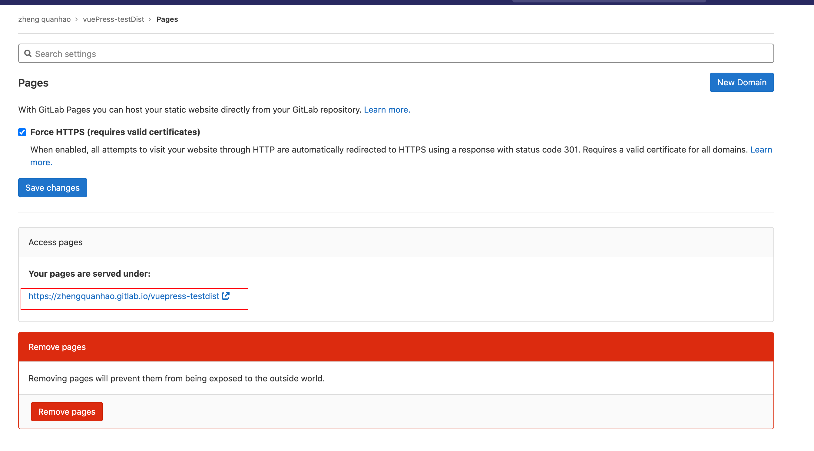

## 一、GitHub部署项目

GitHub中找到要部署的项目，点击`"Settings"`

点击设置里的`"Pages"`, 选择分支为`"master分支"`，目录为`"/docs"`。并点击`"save"`保存。
最终便在上方会生成GitHub分配给你的该项目对应的部署地址。

## 二、GitLab部署项目

编辑`".gitlab-ci.yml"`文件，选择模板为`"HTML"`

点击`"Settings/Pages"`，会发现GitLab分配给你的该项目对应的部署地址。

