## 前言

微软的 VS Code 是一个免费的开源代码编辑器，最近越来越受欢迎。它非常轻巧、灵活，同时也提供了很多强大的功能，但也许最酷的是 VS Code 提供了规模超大的扩展插件，下面将给你介绍一些适合前端的顶级 VS Code 扩展插件。

## 一、主题图标

### 1.1 Material Theme

`VS Code`最悠久的主题, 想要自定义编辑器主题的小伙伴可以安排起来啦！

[Material Theme插件地址](https://marketplace.visualstudio.com/items?itemName=Equinusocio.vsc-material-theme)

### 1.2 vscode-icons

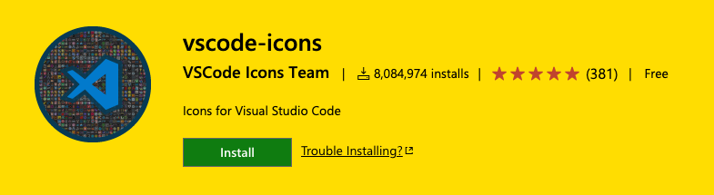

**插件效果：**

[vscode-icons插件地址](https://marketplace.visualstudio.com/items?itemName=vscode-icons-team.vscode-icons)

## 二、浏览器相关

### 2.1 open in brower

通过该插件用户可以在编辑器中快速在浏览器中打开 `HTML` 文件，该浏览器可以是计算机上安装的任何浏览器。

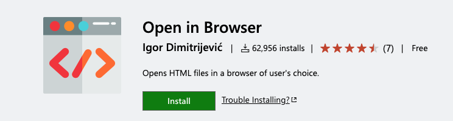

**插件效果：**

Window: 使用快捷键 `Alt+B` 查看效果。
Mac: 使用快捷键 `option+B` 查看效果。

[open in brower插件地址](https://marketplace.visualstudio.com/items?itemName=techer.open-in-browser)

### 2.2 Browser Preview

可在编辑器中打开一个浏览器进行实时的预览，甚至调试。

**插件效果：**

[Browser Preview插件地址](https://marketplace.visualstudio.com/items?itemName=auchenberg.vscode-browser-preview)

## 三、汉化插件

### Chinese (Simplified) Language Pack for Visual Studio Code

安装此插件并重新加载vscode后，你会惊奇的发现编辑器的语言从默认的英文变成中文啦，英文不好的同学不用再挠头啦！

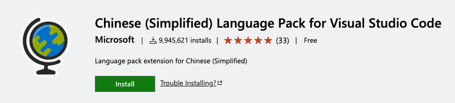

[汉化插件地址](https://marketplace.visualstudio.com/items?itemName=MS-CEINTL.vscode-language-pack-zh-hans)

## 四、开发效率提升

### 4.1 Html Language Features

当你在书写html时，`Html Language Features`会提示完整的标签名称。

**插件效果：**

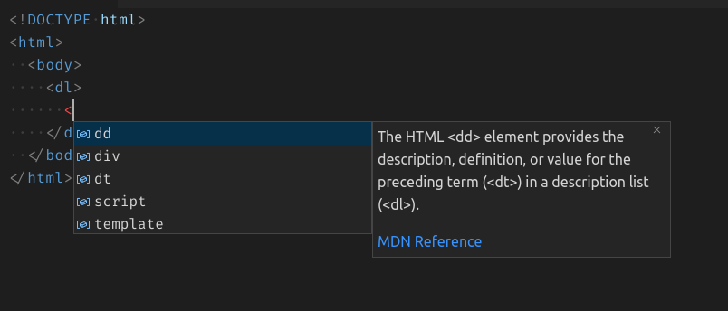

[Html Language Features插件地址](https://marketplace.visualstudio.com/items?itemName=SimonSiefke.html-language-features)

### 4.2 Auto Close Tag

自动闭合 `HTML` 标签。

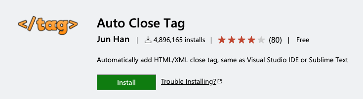

**插件效果：**

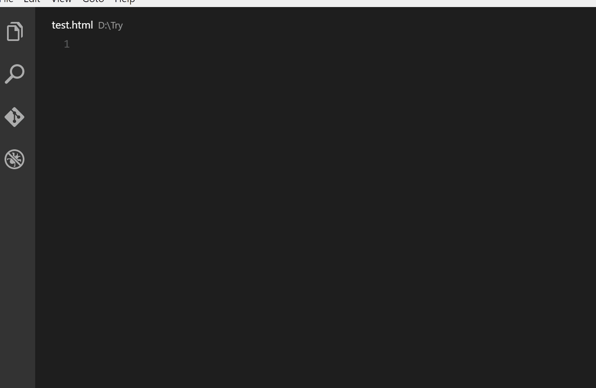

[Auto Close Tag插件地址](https://marketplace.visualstudio.com/items?itemName=formulahendry.auto-close-tag)

### 4.3 Auto Rename Tag

自动重命名配对的 `HTML` 标签。

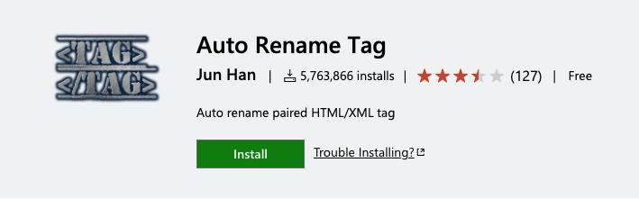

**插件效果：**

[Auto Rename Tag插件地址](https://marketplace.visualstudio.com/items?itemName=formulahendry.auto-rename-tag)

### 4.4 CSS Peek

根据类名快速定位到CSS代码。

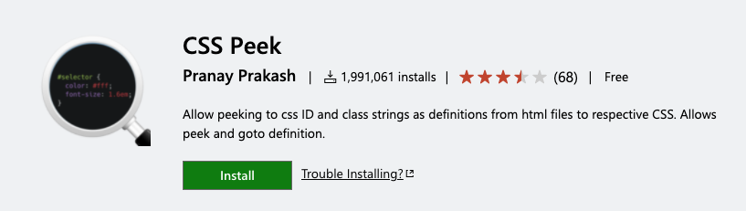

**插件效果：**

[CSS Peek插件地址](https://marketplace.visualstudio.com/items?itemName=pranaygp.vscode-css-peek)

### 4.5 IntelliSense for CSS class names in HTML

帮助开发者提供 CSS 类名补全。

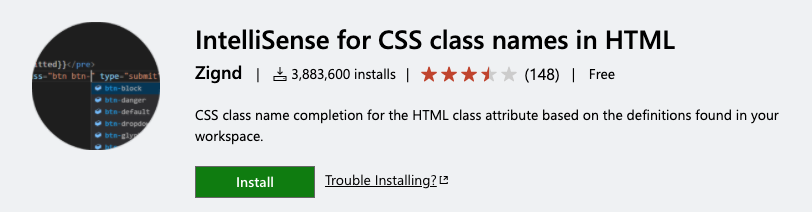

**插件效果：**

[IntelliSense for CSS class names in HTML插件地址](https://marketplace.visualstudio.com/items?itemName=Zignd.html-css-class-completion)

### 4.6 lit-html

在JavaScript/TypeScript的文件中，如果有使用到HTML标记，lit-html提供语法高亮和相应的补全支持。

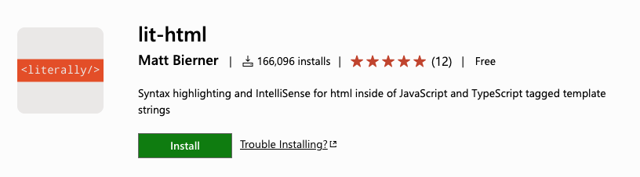

**插件效果：**

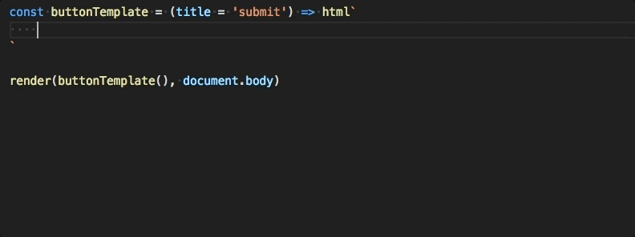

[lit-html插件地址](https://marketplace.visualstudio.com/items?itemName=bierner.lit-html)

### 4.7 Todo Tree

最实用的vscode插件，在我们的代码书写过程中经常会有需要待办的代码，比如这段代码后续需要优化，在这时可以利用todo tree做一个标记，做过的标记都会出现在插件的树视图中。等到我们达到可做后续开发的条件是，便可直接通过树视图快速定位到之前标记的代码处继续开发。

**插件效果：**

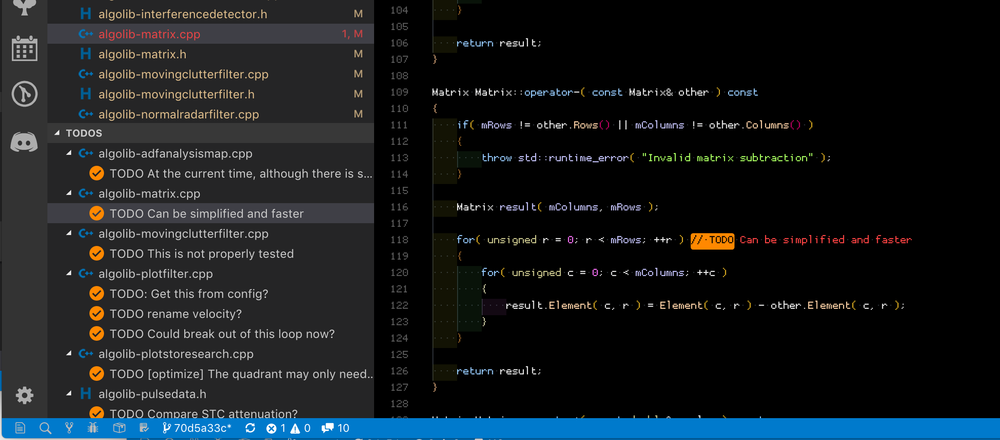

[Todo Tree插件地址](https://marketplace.visualstudio.com/items?itemName=Gruntfuggly.todo-tree)

### 4.8 Bookmarks

使用书签标记/取消标记位置，今后便可快速定位到打标位置的代码。

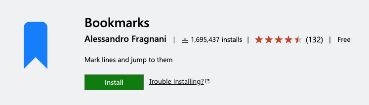

**插件效果：**

[Bookmarks插件地址](https://marketplace.visualstudio.com/items?itemName=alefragnani.Bookmarks)

### 4.9 Quokka.js

实时执行JavaScript代码

**插件效果：**

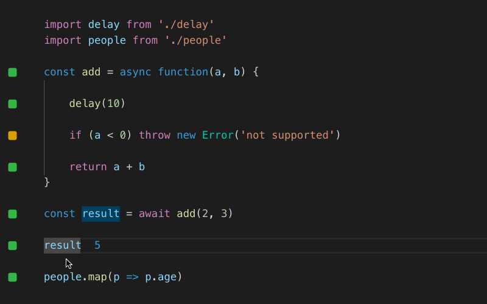

[Quokka.js插件地址](https://marketplace.visualstudio.com/items?itemName=WallabyJs.quokka-vscode)

## 五、Git相关

### 5.1 Git Graph

查看存储库的 Git 图表，并从图表轻松执行 Git 操作。

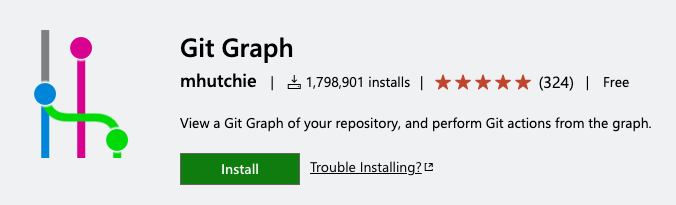

**插件效果：**

[Git Graph插件地址](https://marketplace.visualstudio.com/items?itemName=mhutchie.git-graph)

### 5.2 GitLens

GitLens帮助您更好地理解代码。快速了解更改行或代码块的人、原因和时间。回顾历史，以进一步了解代码如何以及为何演变。轻松探索代码库的历史和演变。

**插件效果：**

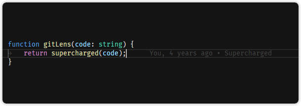

[GitLens插件地址](https://marketplace.visualstudio.com/items?itemName=eamodio.gitlens)

### 5.3 Git History

查看和搜索 git log 以及图表和详细信息，比较分支、比较提交等。

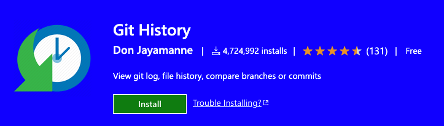

**插件效果：**

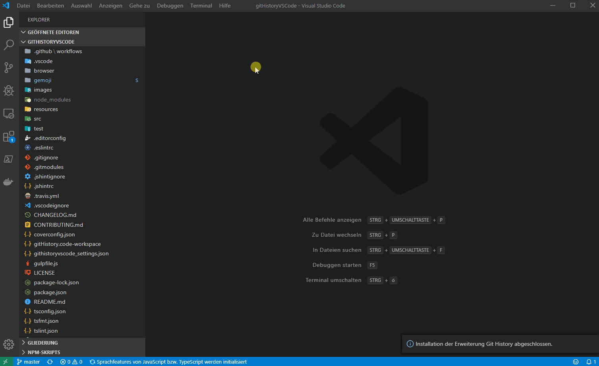
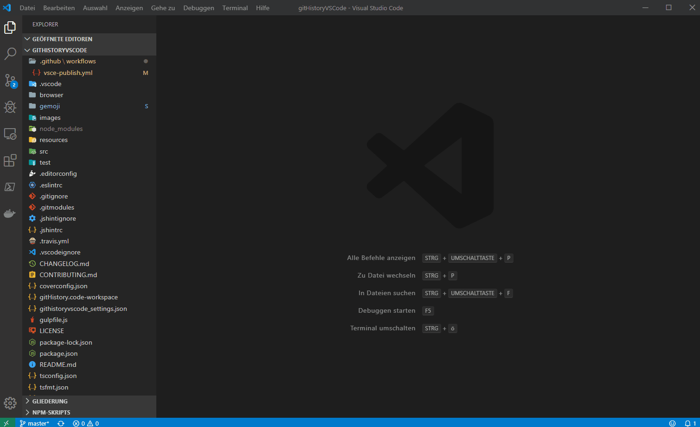
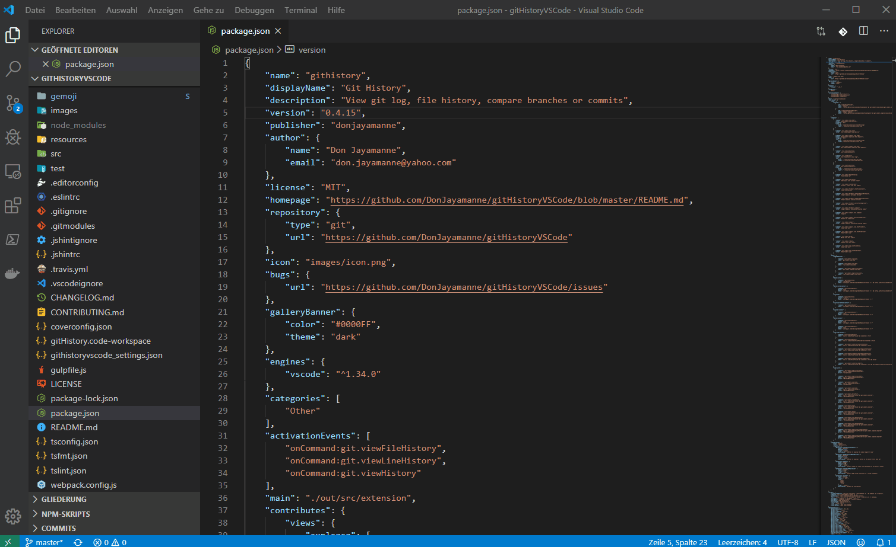
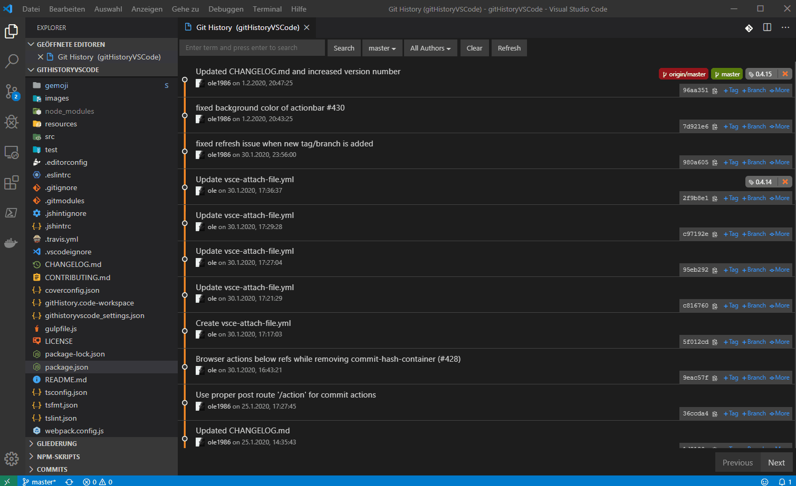

[Git History插件地址](https://marketplace.visualstudio.com/items?itemName=donjayamanne.githistory)

## 六、代码显示与代码规范

### 6.1 ESlint

检测书写的代码，让开发人员代码书写更规范。

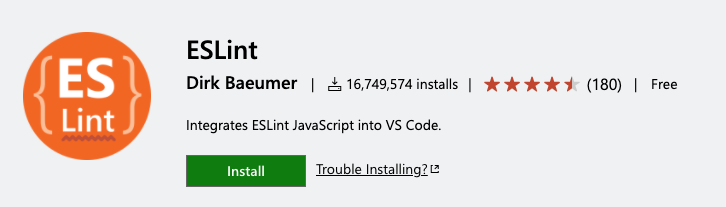

**插件效果：**

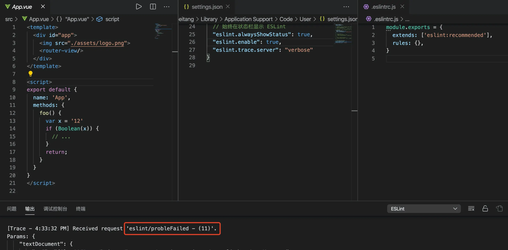

[ESlint插件地址](https://marketplace.visualstudio.com/items?itemName=dbaeumer.vscode-eslint)

### 6.2 CSS Formatter

格式化css代码，使你的css代码变得工整。

[CSS Formatter插件地址](https://marketplace.visualstudio.com/items?itemName=aeschli.vscode-css-formatter)

### 6.3 Bracket Pair Colorizer

使你的代码中括号的层级关系更加鲜明。

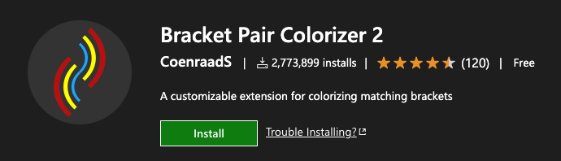

**插件效果：**

[Bracket Pair Colorizer插件地址](https://marketplace.visualstudio.com/items?itemName=CoenraadS.bracket-pair-colorizer-2)

### 6.4 highlight-matching-tag

高亮匹配的标签。

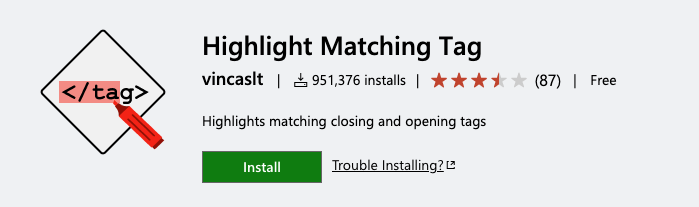

**插件效果：**

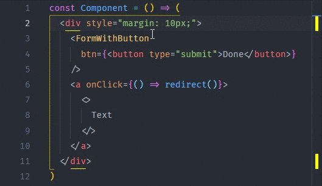

[highlight-matching-tag插件地址](https://marketplace.visualstudio.com/items?itemName=vincaslt.highlight-matching-tag)

### 6.5 Indent-Rainbow

让代码缩进更具可读性。

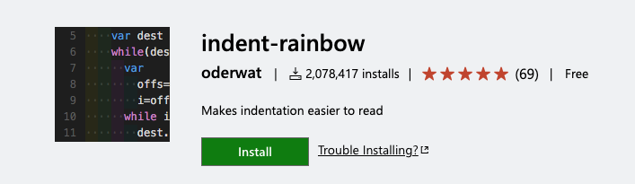

**插件效果：**

[Indent-Rainbow插件地址](https://marketplace.visualstudio.com/items?itemName=oderwat.indent-rainbow)

### 6.6 Trailing Spaces

高亮那些冗余的空格，可以快速删掉。

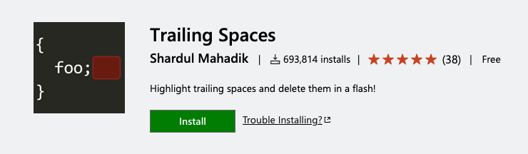

**插件效果：**

[Trailing Spaces插件地址](https://marketplace.visualstudio.com/items?itemName=shardulm94.trailing-spaces)

### 6.7 Color Highlight

解析编写的rgba或16进制颜色，并高亮显示。

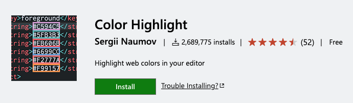

**插件效果：**

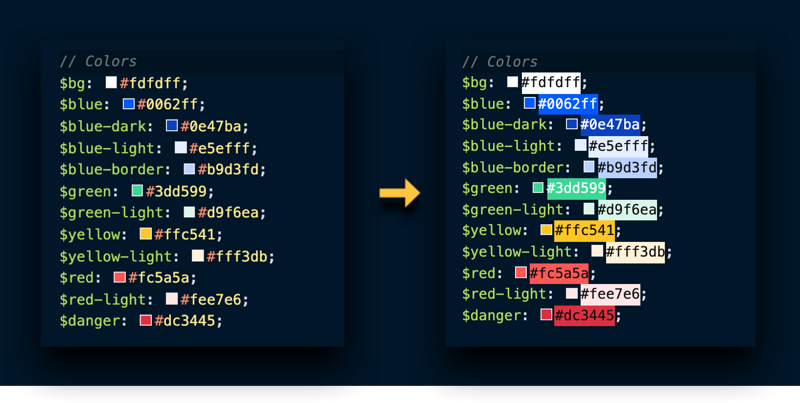

[Color Highlight插件地址](https://marketplace.visualstudio.com/items?itemName=naumovs.color-highlight)

### 6.8 SVG Viewer

方便开发者在编译器中查看SVG图标，而不是仅仅显示一串代码。

**插件效果：**

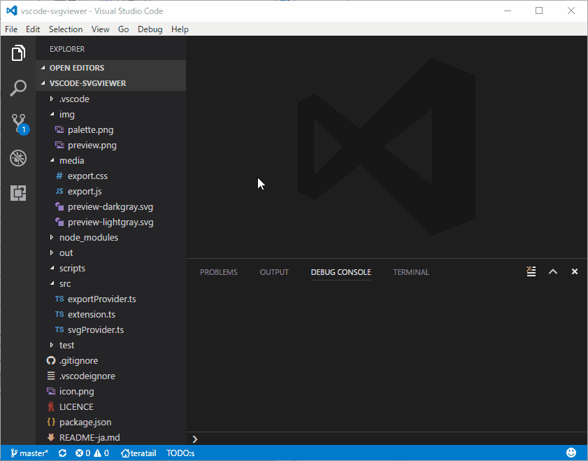

[SVG Viewer插件地址](https://marketplace.visualstudio.com/items?itemName=cssho.vscode-svgviewer)

### 6.9 Vetur

可以将 `.vue` 文件中的语法进行高亮显示，Vetur 不仅支持 Vue 中的 template 模板以外，还支持大多数主流的前端开发脚本和插件。

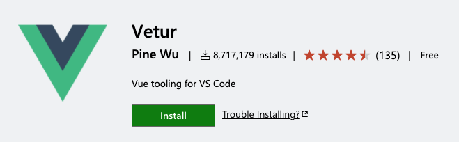

[Vetur插件地址](https://marketplace.visualstudio.com/items?itemName=octref.vetur)

## 七、服务器相关

### Live Server

为静态和动态页面启动具有实时重新加载功能的本地开发服务器。

**插件效果：**

插件使用方法：右键单击HTML资源管理器窗口中的文件，然后单击Open with Live Server。
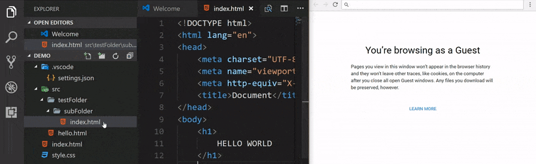

[Live Server插件地址](https://marketplace.visualstudio.com/items?itemName=ritwickdey.LiveServer)

## 八、其他

### 8.1 File Utils

提供了一个更加简洁的方法来创建、复制、移动、重命名、删除文件/文件夹。

**插件效果：**

[File Utils插件地址](https://marketplace.visualstudio.com/items?itemName=sleistner.vscode-fileutils)

### 8.2 Comment Translate(英文翻译插件)

识别代码中注释部分，不干扰阅读。支持不同语言，单行、多行注释

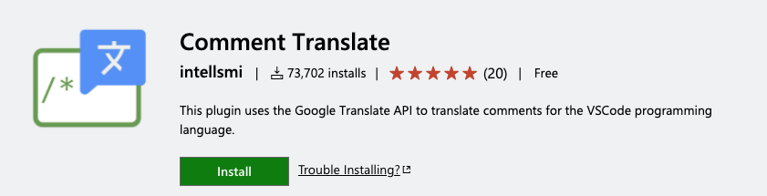

**插件效果：**

支持用户字符串与变量翻译,支持驼峰拆分
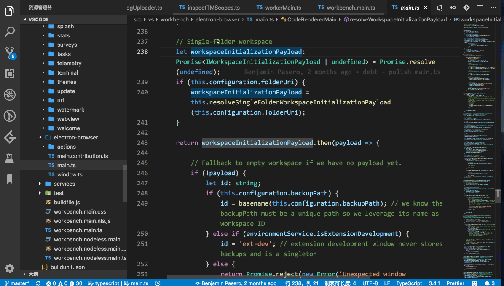
选择区域翻译 - 划词翻译
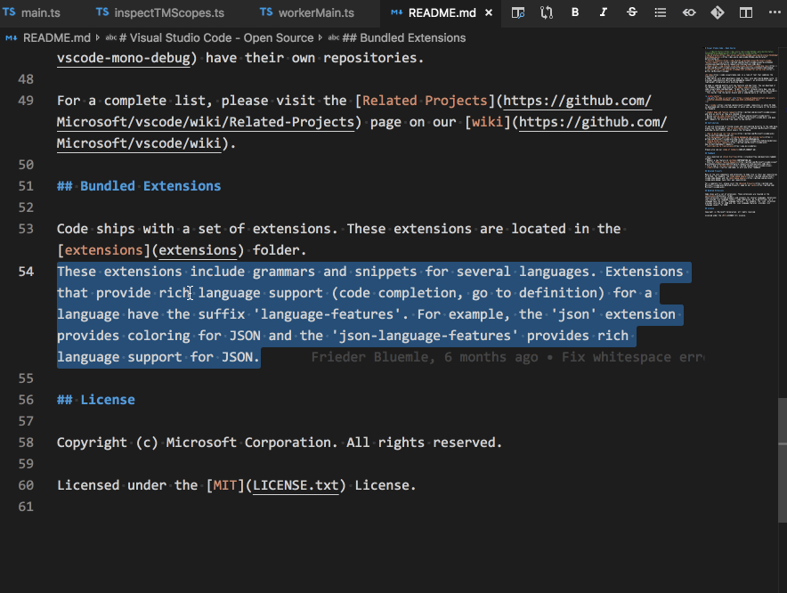

[Comment Translate插件地址](https://marketplace.visualstudio.com/items?itemName=intellsmi.comment-translate)

### 8.3 前端工具箱

把面试题、常用资料导航装到VSCode里，超级方便！

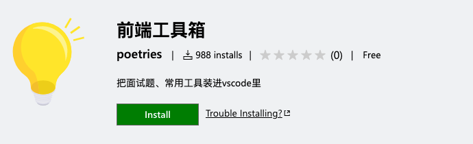

**插件效果：**

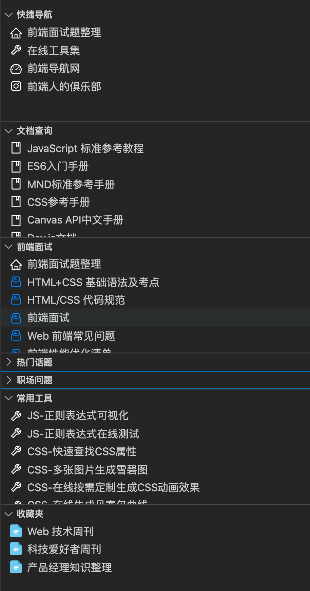

[前端工具箱插件地址](https://marketplace.visualstudio.com/items?itemName=poetries.fe-tools)

## 总结

> 一同努力，共同成长，顶峰相见